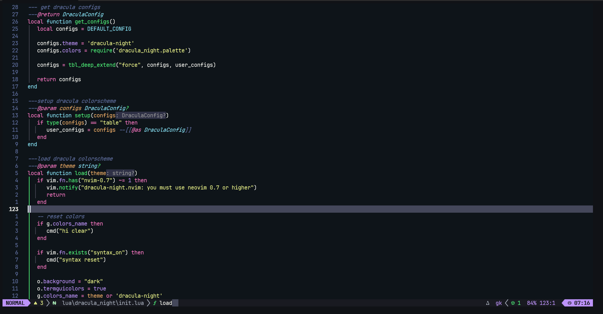
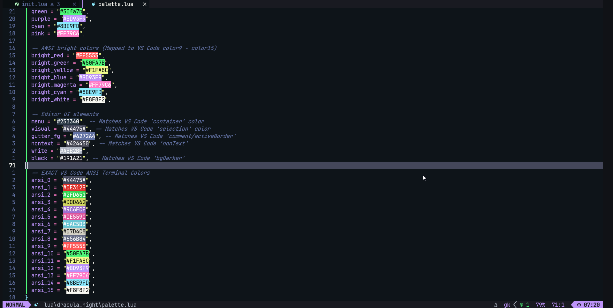

<h1 align="center">🧛‍♂️ dracula-night.nvim</h1>

<p align="center">A <a href="https://draculatheme.com/">Dracula At Night</a> colorscheme for <a href="https://neovim.io/">Neovim</a>, ported from the VS Code theme and written in Lua</p>



## ✔️ Requirements

- Neovim >= 0.9.2
- Treesitter (optional)

## #️ Supported Plugins

- [LSP](https://github.com/neovim/nvim-lspconfig)
- [Treesitter](https://github.com/nvim-treesitter/nvim-treesitter)
- [nvim-compe](https://github.com/hrsh7th/nvim-compe)
- [nvim-cmp](https://github.com/hrsh7th/nvim-cmp)
- [blink.cmp](https://github.com/Saghen/blink.cmp/)
- [Telescope](https://github.com/nvim-telescope/telescope.nvim)
- [NvimTree](https://github.com/kyazdani42/nvim-tree.lua)
- [NeoTree](https://github.com/nvim-neo-tree/neo-tree.nvim)
- [BufferLine](https://github.com/akinsho/nvim-bufferline.lua)
- [Git Signs](https://github.com/lewis6991/gitsigns.nvim)
- [Lualine](https://github.com/hoob3rt/lualine.nvim)
- [LSPSaga](https://github.com/glepnir/lspsaga.nvim)
- [indent-blankline](https://github.com/lukas-reineke/indent-blankline.nvim)
- [nvim-ts-rainbow](https://github.com/p00f/nvim-ts-rainbow)
- [nvim-dap-ui](https://github.com/rcarriga/nvim-dap-ui)
- [mini.indentscope](https://github.com/echasnovski/mini.indentscope)
- [mini.icons](https://github.com/echasnovski/mini.icons)
- [mini.statusline](https://github.com/echasnovski/mini.statusline)
- [mini.files](https://github.com/echasnovski/mini.files)
- [alpha-nvim](https://github.com/goolord/alpha-nvim)
- [dashboard-nvim](https://github.com/nvimdev/dashboard-nvim)
- [snacks.nvim](https://github.com/folke/snacks.nvim)
- [neogit](https://github.com/NeogitOrg/neogit)
- [flash.nvim](https://github.com/folke/flash.nvim)
- [nvim-notify](https://github.com/rcarriga/nvim-notify)

## ⬇️ Installation

Install via your preferred package manager:

```lua
-- lazy.nvim
{
  "ryovoid/dracula-night",
  lazy = false,
  priority = 1000,
  config = function()
    vim.cmd[[colorscheme dracula-night]]
  end,
}
```

```lua
-- packer.nvim
use "ryovoid/dracula-night"
```

```vim
" vim-plug
Plug 'ryovoid/dracula-night'
```

## 🚀 Usage

```lua
-- Lua:
vim.cmd[[colorscheme dracula-night]]
```

```vim
" Vim-Script:
colorscheme dracula-night
```

If you are using [`lualine`](https://github.com/hoob3rt/lualine.nvim), you can also enable the provided theme:

```lua
require('lualine').setup {
  options = {
    -- ...
    theme = 'dracula-night'
    -- ...
  }
}
```

If you are using [LazyVim](https://github.com/LazyVim/LazyVim), you can add this to your `plugins/colorscheme.lua` file:

```lua
return {
  { "ryovoid/dracula-night", lazy = false, priority = 1000 },

  {
    "LazyVim/LazyVim",
    opts = {
      colorscheme = "dracula-night",
    },
  },
}
```

## 🔧 Configuration

The configuration must be run **before** the `colorscheme` command to take effect.

```lua
local dracula_night = require("dracula_night")
dracula_night.setup({
  -- show the '~' characters after the end of buffers
  show_end_of_buffer = true, -- default false
  -- use transparent background
  transparent_bg = true, -- default false
  -- set custom lualine background color
  lualine_bg_color = "#44475a", -- default nil
  -- set italic comment
  italic_comment = true, -- default false
  -- overrides the default highlights with table see `:h synIDattr`
  overrides = {},
  -- You can use overrides as table like this
  -- overrides = {
  --   NonText = { fg = "white" }, -- set NonText fg to white
  --   NvimTreeIndentMarker = { link = "NonText" }, -- link to NonText highlight
  --   Nothing = {} -- clear highlight of Nothing
  -- },
  -- Or you can also use it like a function to get color from theme
  -- overrides = function (colors)
  --   return {
  --     NonText = { fg = colors.white }, -- set NonText fg to white of theme
  --   }
  -- end,
})
```

## 🎨 Importing colors for other usage

```lua
local colors = require("dracula_night").colors()
```

This will return the full palette table including all theme colors:



## 🙏 Credits

This colorscheme is a fork of [Mofiqul/dracula.nvim](https://github.com/Mofiqul/dracula.nvim), re-engineered as a standalone port of the [Dracula At Night](https://marketplace.visualstudio.com/items?itemName=bceskavich.theme-dracula-at-night) VS Code theme with exact color matching, including ANSI terminal colors.
